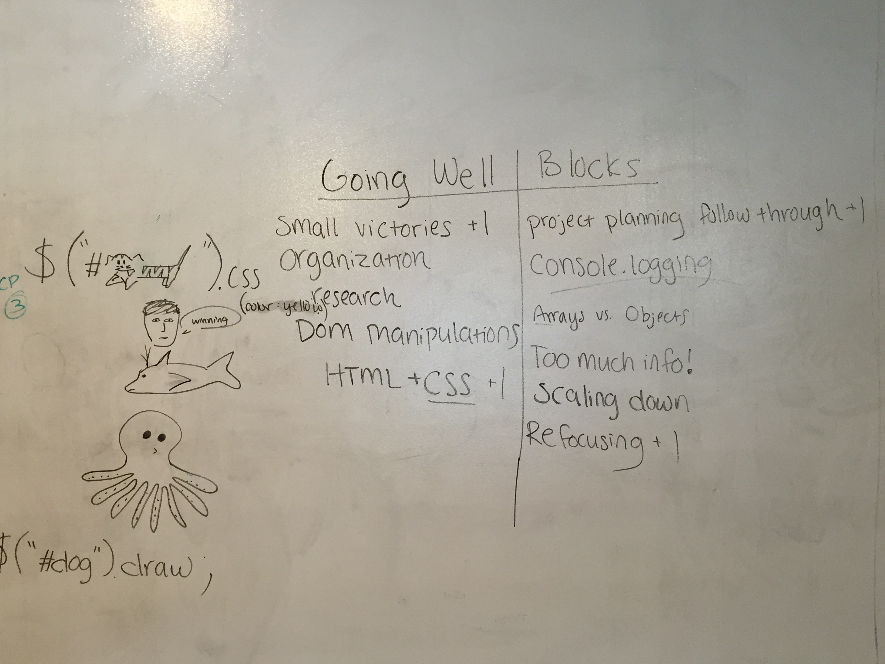

Project1

You've played this before!

Memorizing MnM's

Click on any two m&m cards.
If the two m&m colors match, you score a point.
Remember what was on each card and where it was.
If they don't match, cards will be turned back over.
The game is over when all the cards have been matched.
It's just for funn!!

BitBalloon:
http://bartender-crab-seven.bitballoon.com/

Technologies:
- Jquery
- Javascript
- HTML
- CSS

Tools to help organize game:
- Trello
- User Stories
- Simple wireframe

Shout OUTS :
All Instructors
Stand Up leader, best artist: Dani
Classmates 
Mentors: Danny & Daniel
TA's - Daniel Gih, Tae Tae

