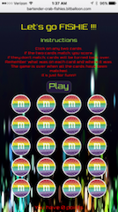
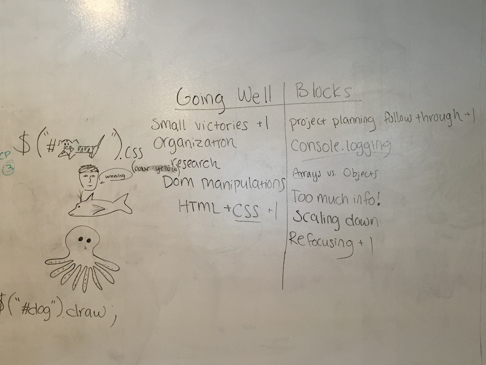

#**Project1**

You've played this before!

##Memorizing MnM's

###Instructions
Please type your name in pop-up box to start the game.
Click on any two m&m cards.
If the two m&m colors match, you score a point.
Remember what was on each card and where it was.
If they don't match, cards will be turned back over.
The game is over when you match all the cards which means 10 points total.
It's just for funnz!!

**Play Game: [Memorizing MnM's](http://bartender-crab-fishies.bitballoon.com/)

###Technologies:
* Jquery
* Javascript
* HTML
* CSS
* Bootstrap

###Tools to help organize game:
* Trello
* User Stories
* Simple wireframe
* Bit Balloon

###Shout OUTS :
All Instructors
Stand Up leader, best artist: Dani - thanks for keeping us moving
Classmates - positive vibes, encouraging words
Mentors: Danny & Daniel
TA's - Daniel Gih, Tae Tae

